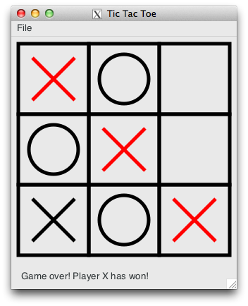

Tic Tac Toe using GTK 3, Mac OS X and Python 3.5
================================================

Implementation of Tic Tac Toe using GTK+ 3, Mac OS X and Python 3.5.

Installation
------------

Install the necessary packages for Python 3.5 using MacPorts (https://www.macports.org):

.. code-block:: bash

    $ sudo port install gobject-introspection gtk3 py35-gobject3

When creating the virtualenv for this project make sure that you:

- specify the Python 3.5 interpreter for which you have installed the above dependencies, and
- ensure that the Python interpreter in the virtualenv has access to those Python packages:

.. code-block:: bash

    $ mkvirtualenv gtk3-tic-tac-toe \
        --python=/opt/local/Library/Frameworks/Python.framework/Versions/3.5/bin/python3.5 \
        --system-site-packages

Lastly, install XQuartz (http://www.xquartz.org) to run X.Org X Window System on Mac OS X.

How to run
----------

You need to make sure XQuartz is running.

You can then start the application using:

.. code-block:: bash

    python -m tictactoe
